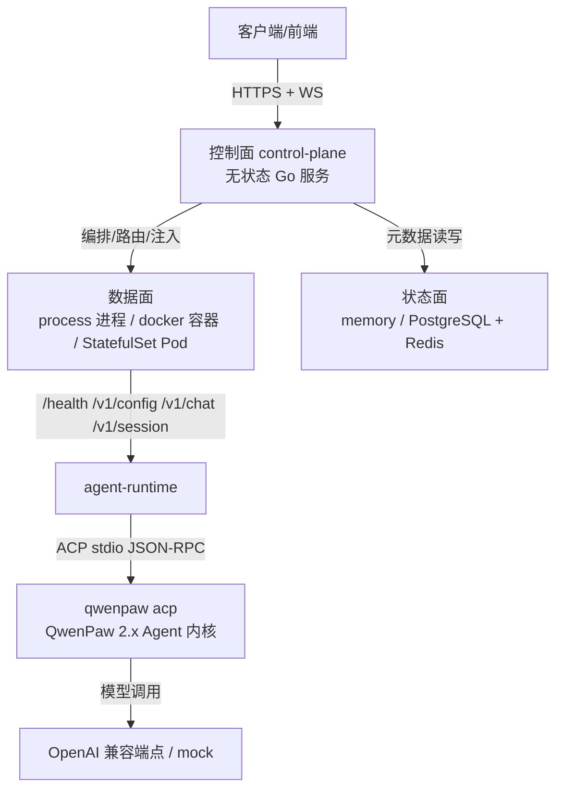
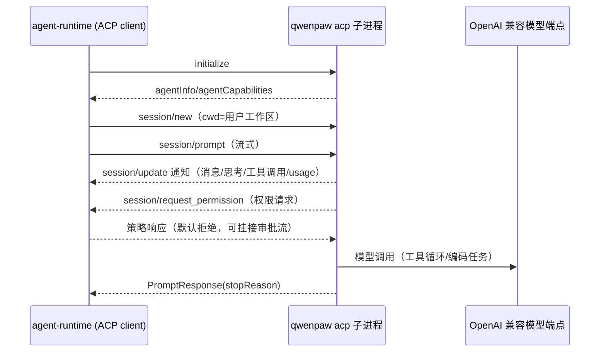
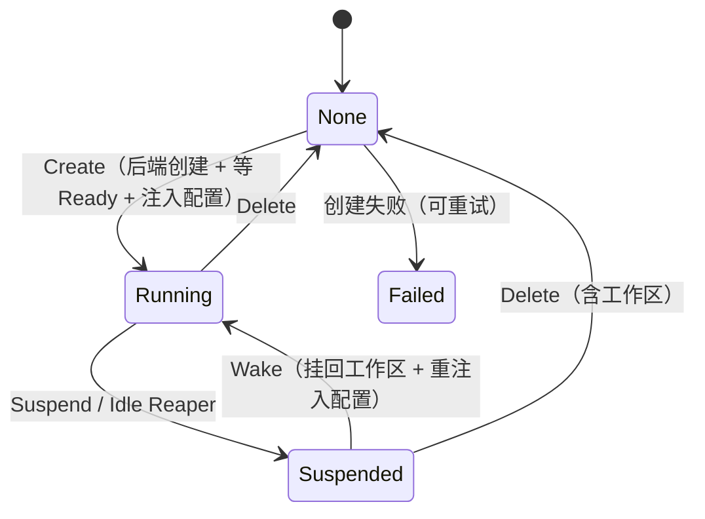
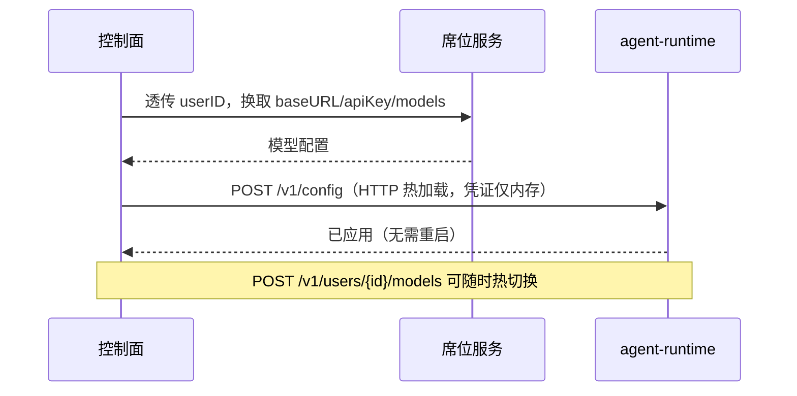
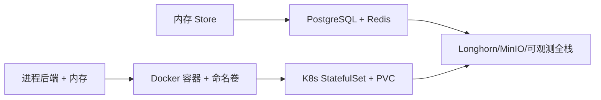

# 架构设计：本地方案 ↔ 云端设计映射

## 1. 总览

需求文档的三平面模型在本地实现中一一对应：



| 文档设计 | 本地实现 | 说明 |
| --- | --- | --- |
| 控制面无状态、可水平扩展 | `internal/controlplane` | 全部状态在 Store/缓存，进程可多开（本地单进程演示） |
| StatefulSet 每用户一实例 | `internal/backend` 三实现 | 语义一致：Create/Suspend/Wake/Delete |
| 稳定网络标识路由 | 进程：稳定端口；K8s：Pod DNS | 均记录在实例记录，按 userID 精确路由 |
| PVC 持久化工作区 | 目录 / Docker 命名卷 / PVC | 休眠销毁运行时，工作区保留 |
| 凭证不落盘 | apiKey 仅内存/Redis 缓存（TTL） | 休眠即丢，唤醒重新注入（`Manager.Suspend/Wake`） |
| 席位服务换模型配置 | `MockSeatService` | 可替换为真实席位/计费服务 |
| Agent 内核 | 承载编码能力（工具调用/记忆/沙箱） | QwenPaw 2.x 经 ACP 协议接入（`qwenpaw acp`） |

## 1.5 Agent 内核：QwenPaw ACP 接入

`agent-runtime` 是 ACP（Agent Client Protocol v1）**客户端**，把 QwenPaw 2.x
（`qwenpaw acp`，stdio JSON-RPC server）作为真正的编码内核拉起：



关键设计：

- **凭证不落盘**：子进程以 `--runtime-provider openai-env` 启动，模型配置通过
  `OPENAI_BASE_URL / OPENAI_API_KEY / OPENAI_MODEL` 环境变量注入，进程退出即销毁；
  模型热切换 = 重启子进程注入新凭证（`SyncConfig`），工作区数据不丢。
- **有状态**：`--workspace` 直接指向用户持久工作区；对话历史另有
  `.agent/conversation.jsonl` 兜底，休眠/唤醒、内核重启后消息序号连续。
- **权限策略**：`session/request_permission` 默认拒绝（headless 安全）；
  可设置 `bypassPermissions`（信任沙箱）或挂接控制面审批流。
- **自愈**：子进程异常退出后，下一次请求自动重启并重建会话；
  `session/prompt` 对传输故障重试一次。
- **回退**：qwenpaw 不可用/版本 <2.0/模型为 mock 时自动回退 mock LLM，
  零外部依赖仍可演示全链路。

## 2. 生命周期状态机

实现于 `Manager.Create / Suspend / Wake / Delete`，状态落 Store：



要点：

- **Create** 幂等：已 Running 直接返回；Suspended 自动唤醒。
- **Suspend** 后热缓存删除——凭证不落盘的直接体现。
- **Wake** 永远走「重新解析配置 → 注入」路径，不信任任何持久化凭证。
- **Failed** 状态保留错误信息，再次 Create 会先清理再重建。

## 3. 请求路由

文档 5.1（集群内）与 5.2 方案 A（集群外）的实现路径：

```
前端 ──> 控制面 /v1/users/{id}/chat 或 /session
          └─ 鉴权（Admin Token 或 sha256(ns:userID) 派生 token）
             └─ Manager.ensureRunning → 从 Store 取稳定地址
                └─ 转发到实例 /v1/chat 或 WS /v1/session
```

- 本地：地址为 `http://127.0.0.1:<稳定端口>`；K8s：`http://agent-<userID>-0.agent-svc.<ns>.svc.cluster.local:18585`。
- Pod/容器/进程全部只监听回环或集群内部，外部唯一入口是控制面。

## 4. 模型配置动态注入与热切换



- 骨架与运行时值分离：镜像/工作区不含真实凭证（文档 6.2）。
- `agent-runtime` 同时支持 `--config-file` watch 轮询热加载，对应 K8s pod-exec 挂载临时配置文件的路径。
- Redis 模式下模型配置缓存在 `cloude:modelcfg:<userID>`（TTL），apiKey 不写入缓存值。

## 5. 数据模型

`internal/store/schema.sql` 与文档「八、核心设计：数据模型」一致（user_id 用 TEXT 便于本地演示）：

| 表 | 用途 |
| --- | --- |
| `agent_instances` | 用户 ↔ 实例 ↔ 工作区 ↔ 状态（编排唯一事实来源） |
| `agent_activity` | 活跃度 + WS 连接数（Idle Reaper 输入） |
| `code_reviews` | 异步评审任务与结果 |
| `user_vcs_tokens` | VCS OAuth token（生产加密存储） |

模型凭证**不落任何表**；`Store` 接口提供内存与 PostgreSQL 两个实现，语义一致。

## 6. 安全隔离（文档七）

| 维度 | 本地实现 |
| --- | --- |
| 实例间网络隔离 | 进程/容器只监听 127.0.0.1；K8s 用 NetworkPolicy 默认拒绝 |
| 出网控制 | 默认 mock 不出网；真实模型出口可在 NetworkPolicy 中按需放行/代理 |
| 凭证管理 | 内存/Redis 热缓存 + TTL；仓库零明文（占位 Secret 见 deploy/k8s/06） |
| 命名空间隔离 | K8s 下控制面/数据面分 ns，RBAC 最小权限 |
| 身份校验 | 管理面 Bearer Token；实例级 sha256(ns:userID) 派生 token |

## 7. 可观测与自愈

- `GET /healthz`（控制面）、`GET /health`（实例）双向探活；K8s 清单自带 readiness/liveness Probe。
- 实例 `failed` 状态 + 错误信息可查；Create/Wake 失败自动清理并落 Failed，可重试。
- Idle Reaper 空闲超时自动 Suspend（`--idle-timeout`），释放算力，工作区保留。
- 日志集中到 `data/logs/<userID>.log`（本地）；生产接 Prometheus/Grafana/Loki 为演进项。

## 8. 演进路线



代码层面已把切换点抽象干净：`InstanceBackend`（数据面）与 `Store`/`ModelConfigCache`（状态面）都是接口，演进不改控制面逻辑。
